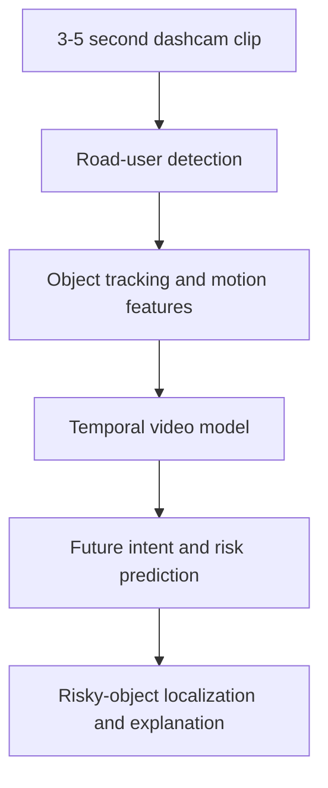

# BD-DriveIntent

### A Bangladesh-Centric Dashcam World Model for Future Traffic Risk and Intent Prediction

BD-DriveIntent is a CSE498R research project focused on predicting near-future traffic risk in Bangladesh's complex mixed-traffic environments. Instead of only detecting what is visible in the current frame, the proposed system will analyze a short dashcam video clip and estimate what a road participant may do in the next few seconds.

The project primarily focuses on pedestrians, rickshaws, CNG auto-rickshaws, motorcycles, buses, and other locally important road users. The final goal is an explainable early-warning system that predicts risk and identifies the object responsible for it.

> **Current status:** Proposal, literature review, learning, and project-planning phase.

## Problem Motivation

Bangladesh has dense and heterogeneous traffic with limited lane discipline, crowded intersections, narrow roads, and frequent interactions among many vehicle types. Models trained mainly on structured international driving datasets may not fully represent these local traffic patterns.

Traditional object detection answers:

> What objects are present now?

BD-DriveIntent aims to answer:

> Which object may create risk in the next 1-3 seconds, and why?

## Research Objectives

- Build a Bangladesh-centric dashcam video dataset for future-risk prediction.
- Create scene-level risk labels: **Safe**, **Caution**, **High Risk**, and **Near-Miss**.
- Create object-level intent labels for important road participants.
- Detect and track pedestrians, rickshaws, CNGs, motorcycles, buses, and other vehicles.
- Develop and evaluate spatio-temporal risk-prediction models.
- Predict pedestrian crossing, rickshaw cut-in, and CNG sudden-turn or sudden-stop intent.
- Highlight the risky object using bounding boxes, attention maps, or risk scores.
- Build a simple Streamlit or Gradio demonstration application.

## Proposed System



### Expected Input

A short 3-5 second dashcam video showing a Bangladesh road scene.

### Expected Output

- Scene risk: Safe, Caution, High Risk, or Near-Miss
- Object-level intent probability
- Risk score
- Risky-object bounding box or heatmap
- A short explanation, such as `Rickshaw entering the ego vehicle path`

## Target Road Participants

- Pedestrian
- Rickshaw
- CNG auto-rickshaw
- Motorcycle
- Bus and truck
- Private car and van
- Bicycle
- Easy bike or battery rickshaw
- Leguna or other local transport
- Roadside obstacle

## Dataset Plan

The project will collect or curate Bangladesh road footage and convert long videos into short clips.

| Stage | Raw footage | Target clips | Purpose |
|---|---:|---:|---|
| Minimum prototype | 20-50 hours | 2,000-5,000 | Initial dataset and working demo |
| Main capstone target | 100-200 hours | 10,000-30,000 | Strong experiments and paper draft |
| Future extension | 300-500 hours | 30,000-70,000 | Larger benchmark or journal extension |

Planned metadata includes road type, location category, time of day, weather, traffic density, risk label, risk-onset time, and risk-causing object.

Large videos, datasets, and model weights will not be stored directly in this Git repository. They will be managed through controlled local or cloud storage, while the repository will contain code, small samples, metadata schemas, and documentation.

## Planned Models

### Baselines

- Frame-based CNN classifier
- CNN-LSTM or CNN-GRU
- YOLO with LSTM/GRU
- 3D CNN
- Video Transformer

### Proposed Model

An object-aware world model combining:

1. YOLO or RT-DETR road-user detection
2. ByteTrack, DeepSORT, BoT-SORT, or OC-SORT tracking
3. Object motion and trajectory features
4. GRU, LSTM, or Transformer-based temporal modeling
5. Future-intent and scene-risk prediction heads
6. Explainable object-level risk scoring

## Evaluation Plan

### Scene-Level Risk Classification

- Accuracy
- Precision and recall
- F1-score and Macro-F1
- ROC-AUC
- Confusion matrix

### Object Intent and Localization

- Precision, recall, and F1-score
- Average Precision
- Risky-object localization accuracy

### Future and Early-Risk Prediction

- Average Displacement Error
- Final Displacement Error
- Future bounding-box IoU
- Time-to-event
- Early-warning accuracy

## Six-Month Roadmap

| Month | Main focus | Expected output |
|---:|---|---|
| 1 | Foundation, literature review, tools, and pilot data | Final scope, paper summary, sample YOLO inference, pilot clips |
| 2 | Dataset collection and annotation pipeline | Annotation guideline, organized footage, metadata, data splits |
| 3 | Dataset V1 and baseline models | YOLO results, CNN/CNN-LSTM baselines, initial metrics |
| 4 | Object-aware world model | Tracking, trajectories, proposed model V1, future-risk prediction |
| 5 | Improvement and explainability | Ablations, failure analysis, visual explanations, final experiments |
| 6 | Demo, paper, and final presentation | Demo app, report, research paper, clean repository, presentation |

## Planned Repository Structure

```text
CSE498R-WORLD-MODEL-/
|-- README.md
|-- requirements.txt
|-- configs/
|-- docs/
|-- src/
|   |-- data/
|   |-- detection/
|   |-- tracking/
|   |-- models/
|   |-- evaluation/
|   `-- visualization/
|-- scripts/
|-- notebooks/
|-- sample_data/
|-- sample_outputs/
|-- results/
`-- demo_app.py
```

The structure above is planned and will be created gradually as implementation progresses.

## Current Documents

- [Research Project Proposal](Research%20Project%20Proposal.pdf)
- [Six-Month Learning and Implementation Plan](BD_DriveIntent_6_Month_Learning_Plan_Full.pdf)

## Team Workflow

The project follows a **shared learning path, rotating ownership, and weekly teaching** approach for a three-member team.

- Everyone learns dataset preparation, modeling, evaluation, demonstration, and paper writing.
- Each task has a temporary owner while the other members review and test it.
- Development work is performed on separate branches.
- The `main` branch should remain stable.
- Completed work is reviewed before merging.

Example branches:

```text
memberA/yolo-training
memberB/clip-extraction
memberC/demo-app
```

## Ethics and Privacy

- Faces and license plates should be blurred before public release.
- Raw footage must be stored securely.
- Private or sensitive locations should be avoided.
- Only anonymized samples should be publicly released.
- All collected data should be used only for permitted academic and research purposes.
- Dataset sources, consent requirements, and licensing restrictions must be documented.

## Expected Deliverables

- Bangladesh dashcam risk dataset and annotation guideline
- Road-participant detection and tracking pipeline
- Risk-prediction baseline models
- Proposed object-aware future-risk model
- Explainable risky-object visualization
- Evaluation results and failure analysis
- Web-based demonstration application
- Final report and research paper draft
- Presentation and demonstration video

## Related Datasets and Research Directions

The literature review considers BDD100K, nuScenes, Waymo Open Dataset, PIE, DoTA, RSUD20K, and BadODD, along with recent work on video models, world models, pedestrian intention, traffic anomaly detection, and early-risk forecasting.

## License

A project license has not yet been selected. Dataset access and model/code licensing will be documented before any public release.

---

**BD-DriveIntent** - CSE498R research project on explainable future traffic-risk prediction for Bangladesh road environments.
